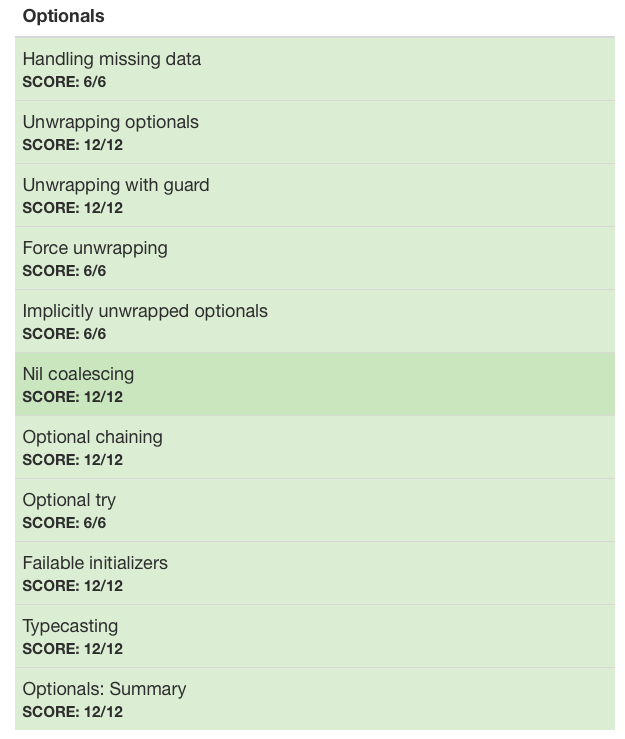

# :white_check_mark: Day 12: Optionals

## Topics:

* Handling missing data
* Unwrapping optionals
* Unwrapping with guard
* Force unwrapping
* Implicity unwrapped optionals
* Nil coalescing
* Optional chaining
* Optional try
* Failable initializers
* Typecasting

## Tests

