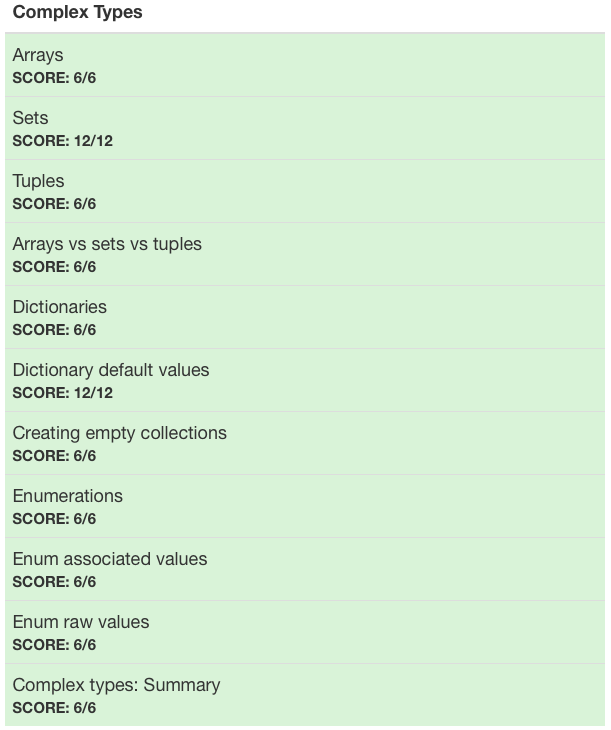

# :white_check_mark: Day 2: Complex types

## Topics:

* Arrays
* Sets
* Tuples
* Arrays vs sets vs tuples
* Dictionaries
* Dictionary default values
* Creating empty collections
* Enumerations
* Enum associated values
* Enum raw values

## Tests

