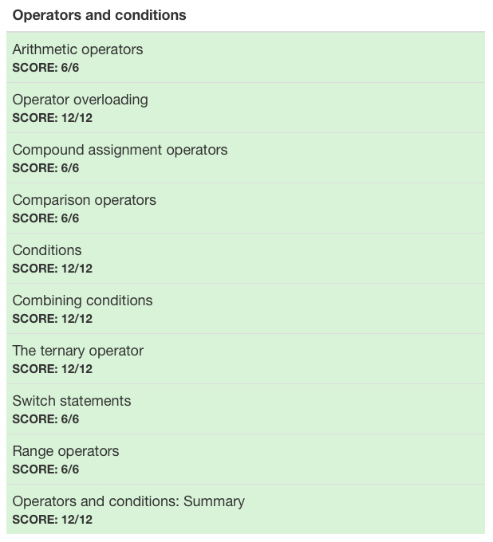

# :white_check_mark: Day 3: Operators and conditions

## Topics:

* Arithmetic operators
* Operator overloading
* Compound assignment operators
* Comparison operators
* Conditions
* Combining conditions
* The ternary operator
* Switch statements
* Range operators

## Tests

