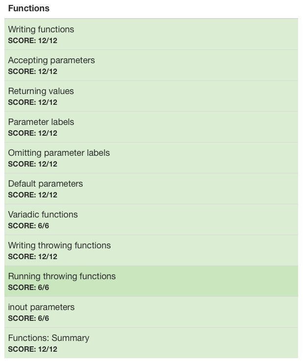

# :white_check_mark: Day 5: Functions

## Topics:

* Writing functions
* Accepting parameters
* Returning values
* Parameter labels
* Omitting parameter labels
* Default parameters
* Variadic functions
* Writing throwing functions
* Running throwing functions
* Inout parameters

## Tests

