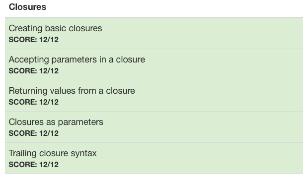

# :white_check_mark: Day 6: Closures 1

## Topics:

* Creating basic closures
* Accepting parameters in a closure
* Returning values from a closure
* Closures as parameters
* Trailing closure syntax

## Tests

