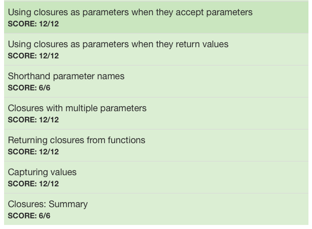

# :white_check_mark: Day 7: Closures 2

## Topics:

* Using closures as parameters when they accept parameters
* Using closures as parameters when they return values
* Shorthand parameter names
* Closures with multiple parameters
* Returning closures from functions
* Capturing values 

## Tests

