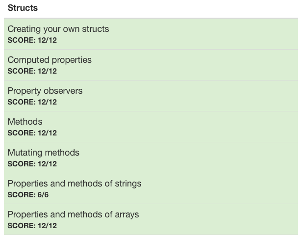

# :white_check_mark: Day 8: Structs 1

## Topics:

* Creating your own structs
* Computed properties
* Property observers
* Methods
* Mutating methods
* Properties and methods of strings
* Properties and methods of arrays

## Tests

